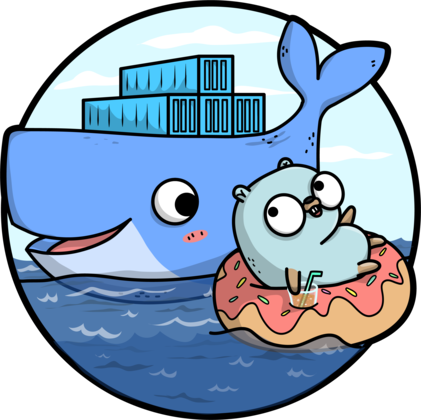

<br />
<p align="center">
  <a href="https://golang.org/">
    
  </a>

  <h3 align="center">TwiggyBuffalo/go-http-server</h3>

  <p align="center">
    A Dockerized HTTP Server example built with Go.
  </p>
</p>

<!-- TABLE OF CONTENTS -->
<details closed="closed">
  <summary>Table of Contents</summary>
  <ol>
    <li>
      <a href="#about-the-project">About The Project</a>
    </li>
    <li>
      <a href="#getting-started">Getting Started</a>
      <ul>
        <li><a href="#prerequisites">Prerequisites</a></li>
        <li><a href="#installation">Installation</a></li>
      </ul>
    </li>
    <li><a href="#usage">Usage</a></li>
    <li><a href="#roadmap">Roadmap</a></li>
    <li><a href="#contributing">Contributing</a></li>
    <li><a href="#license">License</a></li>
    <li><a href="#contact">Contact</a></li>
  </ol>
</details>

<!-- ABOUT THE PROJECT -->

## About The Project

This project was created for me to get familiar with Docker and GitHub Actions. It's a basic HTTP Server example which was yanked [directly from the Golang Docs](https://golangr.com/golang-http-server/)
<br/>
<br/>
Please feel free to take a look at the [workflow](https://github.com/TwiggyBuffalo/go-http-server/blob/master/.github/workflows/build-deploy.yml) file which builds and deploys to DockerHub as well as GitHub Container Registry

<!-- GETTING STARTED -->

## Getting Started

Follow these quick and easy steps and you'll be up and running in no time.

### Prerequisites

This project requires [Go](https://golang.org/)

### Installation

1. Clone the repo
    ```sh
    git clone https://github.com/TwiggyBuffalo/go-http-server.git
    ```
2. Run the project with 
    ```sh
    go run Main.go
    ```

<!-- ROADMAP -->

## Roadmap

See the [open issues](https://github.com/twiggybuffalo/go-http-server/issues) for a list of proposed features (and known issues).

<!-- CONTRIBUTING -->

## Contributing

1. Fork the Project
2. Make your changes
3. Open a Pull Request

<!-- LICENSE -->

## License

Distributed under the MIT License. See `LICENSE` for more information.

<!-- CONTACT -->

## Contact

Twitter - [@TwiggyBuffalo](https://twitter.com/twiggybuffalo)
<br/>
GitHub - [TwiggyBuffalo](https://github.com/TwiggyBuffalo)
